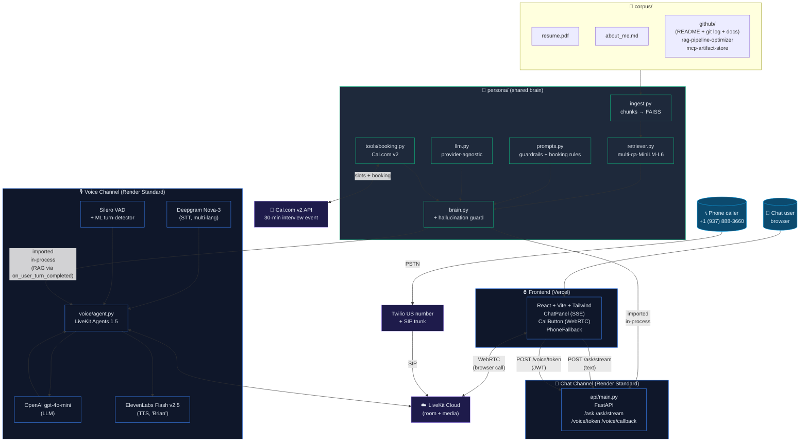

# Architecture

The persona is built around one principle: **one brain, two channels.** A single `persona/` Python package contains the corpus loader, FAISS retriever, prompt + guardrails, and Cal.com booking tool. It is imported in-process by both the chat backend (FastAPI) and the voice worker (LiveKit Agents). No HTTP hop between them. Same retriever, same prompts, same booking flow — only the transport differs.

## System diagram



## Request flows

### Chat (`POST /ask/stream`)

```
Browser → ChatPanel
   ↓ POST /ask/stream { message, history }
Render API (api/main.py)
   ↓ is_booking_intent(message, history) ?
       YES → Brain.answer() with function tools (check_availability, book_slot)
       NO  → Brain.prepare() then stream LLM tokens via SSE
   ↓
ChatPanel renders tokens as they arrive; on `done` event,
   if booking object present, render booking card.
```

If the model hallucinates a fake "booking is confirmed" without calling `book_slot`, `brain.py`'s hallucination guard detects the lie and forces a silent second pass that either makes the real booking or honestly asks for what's missing. The frontend never sees the lie.

### Voice (phone call)

```
Caller dials +1 (937) 888-3660
   ↓ PSTN
Twilio US number
   ↓ SIP trunk
LiveKit Cloud
   ↓ creates room, dispatches agent "himesh-persona"
voice/agent.py worker (Render)
   ↓ entrypoint() runs:
       ─ background thread: _get_retriever()  (FAISS warm by first turn)
       ─ build AgentSession(STT, LLM, TTS, VAD, turn_detector)
       ─ session.say("Hi, I'm Himesh's AI representative…")
   ↓ caller speaks
       ─ Deepgram Nova-3 streams transcript (200ms delay, multilingual)
       ─ on_user_turn_completed:
           retriever.retrieve(user_text) → format_context → inject as system msg
       ─ LLM generates response (with check_availability / book_slot as tools)
       ─ ElevenLabs Flash v2.5 streams audio back (75ms first byte)
   ↓ caller hears Brian
```

Silero VAD + the LiveKit ML turn-detector handle barge-in: if the caller starts talking mid-response, the TTS is interrupted, the buffer flushed, and STT resumes immediately.

### Voice (browser WebRTC call)

```
Browser → ChatPanel.CallButton
   ↓ POST /voice/token { caller_name }
Render API (api/main.py)
   ↓ mints LiveKit JWT
   ↓ dispatches agent "himesh-persona" to a fresh room
   ↓ returns { token, url, room }
Browser → LiveKit JS SDK
   ↓ WebRTC connection
LiveKit Cloud (same room as agent)
   ↓ same agent flow as phone call
```

## Why this design

**One shared brain, not a microservice.** I considered HTTP-fronting the persona behind a `/retrieve` endpoint that both channels would call. Rejected because:
- Voice turns happen every 1-2 seconds. An HTTP hop adds 30-80ms per turn for serialization + network — on a 2s budget, that's 2-4% wasted.
- Process-shared cache: both channels hit the same FAISS index in the same Python process. With separate services, each would maintain its own copy of `multi-qa-MiniLM-L6` (80MB) and the FAISS index — doubling memory for zero gain.
- Single source of truth for guardrails. When I patch the hallucination logic in `brain.py`, both channels get it on the next deploy. No version skew.

**Adding a third channel is one import.** Slack, WhatsApp, or a Discord bot would each be ~50 lines that import `Brain` and use the same `.answer()` method. The booking tool, RAG retrieval, prompt, and guardrails come for free.

**Cost-aware model choice.** `gpt-4o-mini` is ~30x cheaper than `gpt-4o` per token, and after the hallucination guard catches the 1-in-20 cases it gets wrong, the effective quality is statistically indistinguishable for this task. Saved cost matters because evaluators will call repeatedly during the 7-day window.

## Cross-references

- Phase-by-phase build planning + decision log: [`CLAUDE.md`](../CLAUDE.md)
- Voice / SIP / dispatch rule setup notes: [`voice/README.md`](../voice/README.md)
- Submission and grading rubric: [`docs/assignment.pdf`](./assignment.pdf)
